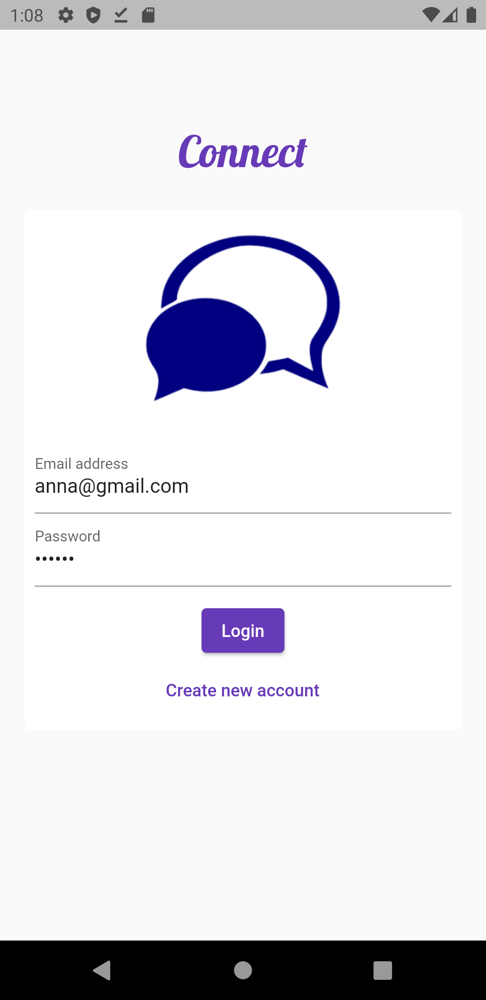

# chat_app

Chat app using Firebase as backend currently working to integrate notifications using the latest version of firebase messaging. 
Any suggestions or help regarding it, would be highly appreciated. 

  &nbsp;   &nbsp;   &nbsp; 